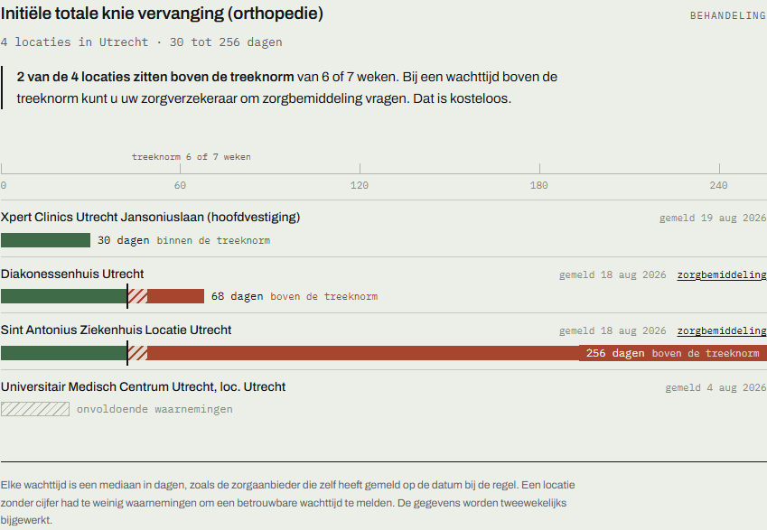
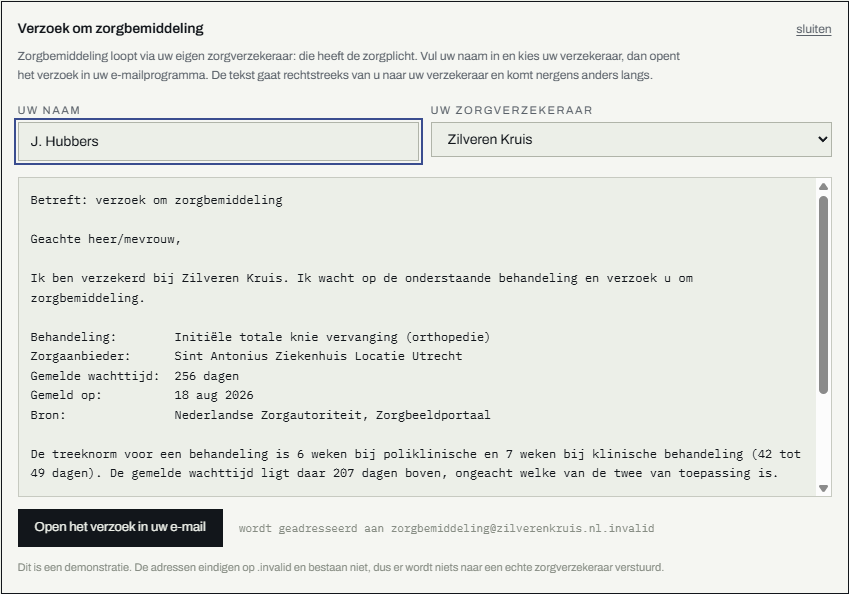
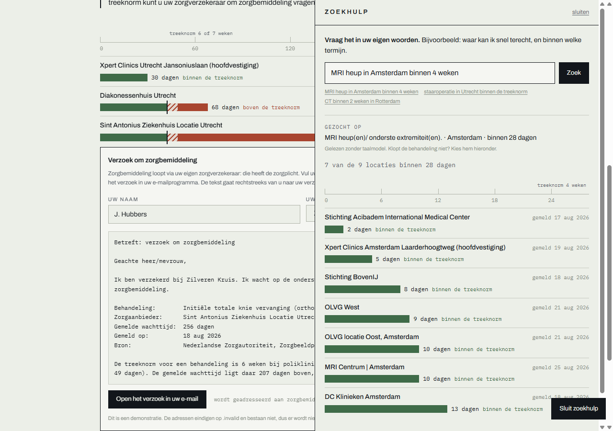

# Wachttijd radar

**Full-stack web app on live government data, with an AI assistant.**

Dutch hospital waiting times, compared per treatment and per location, measured against
the legal norm — and turned into the formal request your insurer is obliged to act on.

`FastAPI + Next.js` · `11,325 live records from the Nederlandse Zorgautoriteit` ·
`natural-language search` · `one Docker command` · `104 tests`



Four hospitals, one city, one treatment, on a single day in August 2026: **30, 68 and
256 days** — and one location that reported too few observations to give a figure at
all. All four are a twenty-minute drive apart.

Waiting times are the most-felt failure of Dutch healthcare, and almost nobody knows
that exceeding the **treeknorm** gives them the right to free *zorgbemiddeling* from
their insurer. Comparison sites tell you the number. This one tells you what it means
and what you can do about it.

---

## What it does

**Compares.** 11,325 waiting times across 335 providers and 811 locations, straight
from the Nederlandse Zorgautoriteit. Every figure carries the date the provider
reported it.

**Judges.** Each wait is measured against the treeknorm from NZa policy TH/BR-025. The
bar turns from green to red where the norm falls, so a list of 116 locations reads as a
gradient from acceptable to unacceptable without reading a single number.

**Acts.** Any wait past the norm can be turned into a zorgbemiddeling request, drafted
from the real figures and addressed to the right insurer.



**Answers.** A question in plain Dutch — *"MRI heup in Amsterdam binnen 4 weken"* —
resolves to a treatment, a city and a deadline, and returns rows from the database.



---

## The parts worth looking at

**Research before building.** The plan was one scraper per hospital website. Checking
first turned up an official NZa endpoint serving the whole country as JSON,
unauthenticated and refreshed every two weeks — so there is no scraping anywhere in
this project. The research is in [`NOTES.md`](NOTES.md).

**Refusing to guess.** TH/BR-025 sets six weeks for outpatient treatment and seven for
inpatient, but NR/REG-2421 art. 4 lid 5 has providers submit both as one category. So a
43–49 day wait is over the norm *if* it is outpatient and within it *if* it is
inpatient, and the data cannot say which. The app reports `within`, `depends` or
`exceeded` and draws the uncertainty as a striped band, as RIVM does with the same
figures. A location reporting too few observations gets no number and no verdict, and
keeps its place in the list saying so.

**Constrained by design.** The assistant emits a structured query — treatment, city,
deadline — and never prose, so it cannot invent a figure or give medical advice. The
zorgbemiddeling letter is built in the browser and handed to the person's own mail
client, so a name and insurer never reach the backend.

**Tested and runnable.** 104 tests across backend and frontend, several of which exist
only to enforce the honesty rules above. One command starts it, and it seeds itself
from the live API on first boot.

---

## Stack

FastAPI + uv (Python 3.12) · Next.js 16 static export + React 19 + Tailwind 4 ·
SQLite · Docker, one image, one port · pytest + vitest · Groq for the assistant,
optional.

## Run it

```bash
docker compose up --build -d      # http://localhost:8000
```

First start fetches once from the NZa API into a named volume; later starts reuse it.
There are idempotent start/stop scripts for Windows and macOS in [`scripts/`](scripts).
No API key is needed for anything.

---

## How this was built

Written with **Claude Code (Opus 5)** in a single session, and the way it was run
matters more than the fact that it was:

**Small increments, each one verified before the next.** Fetch → store → API → screen →
container → norm check → request → assistant. Every step ended with tests passing and
the real thing running against real data, not with a claim that it should work.

**Reviewed and redirected continuously.** I read the diffs and pushed back, and several
things changed or came out because of it. A trend-over-time view was built, shipped and
then reverted as noise. Bar colours were toned down. The assistant moved from a block in
the page into a slide-out panel. The DigiD-style login in the original plan was dropped
once it became clear it would gate nothing. The reversals are in the git history rather
than tidied away.

**No subagents and no agent teams.** One session, direct edits, reviewed as they
happened. This was a project where every decision needed a person in the loop rather
than parallel work.

**Decisions recorded as they were made.** [`NOTES.md`](NOTES.md) holds the research and
the open questions, [`planning/PLAN.md`](planning/PLAN.md) the shape of the build, and
[`CLAUDE.md`](CLAUDE.md) the rules the code must not break — including one that was
deliberately relaxed to build the assistant, with the reason and the date written down.

**Bugs are in the log with their causes.** A ruler whose axis and bars used different
widths. A 500 on any deadline nothing met. A `.gitignore` rule that silently excluded
three source files. Each was found by looking at the running thing rather than trusting
the code, and each commit message says how.

---

## Scope

**Navigation and drafting, not diagnosis.** No symptom checker, no triage, no advice
about what care someone needs — that would move the app toward medical-device territory
under the MDR and high-risk territory under the EU AI Act.

**Public aggregate data only**, no accounts and no login. Nothing in the app is
per-person, so there is nothing to store and nothing to log in to.

**Ggz is deliberately out.** There is no NZa endpoint for it, and the 2026 transition to
declaratiedata makes published figures unreliable. The conditions for adding it are
written down.

Demo email addresses end in `.invalid` and cannot resolve, so nothing here can reach a
real insurer.
